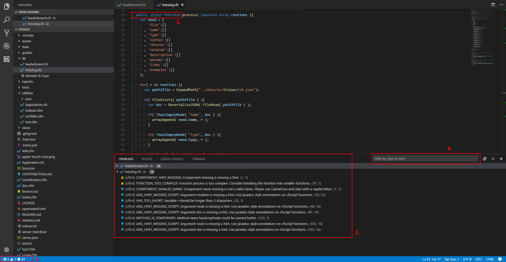

# VS Code CFLint

An extension to integrate CFLint into Visual Studio Code.


## Features

**CFLint** is a linter for CFML and you can find more information at its [GitHub repository](https://github.com/cflint/CFLint). This extension integrates **CFLint** into the editor and Problems view.

The extension uses the **CFLint** tool to scan CFML files and provide feedback on potential issues. The ways in which this is triggered are configurable in the settings (see below). It optionally takes rule configuration via a `.cflintrc` file. This extension facilitates the creation and viewing of this file via [Commands](#commands).

Here is an example from the [CFDocs](https://github.com/foundeo/cfdocs) project using **CFLint** v1.1.0 with no rule configuration.



1. The status bar item for Problems. Indicates number of Error, Warning, and Info issues reported. Clicking it will bring up the Problems view. Alternatively, you can use `Ctrl+Shift+M`.
2. The Problems view. Grouped by file, ordered by severity, line number, column number. Clicking the problem will focus the issue in the editor.  
```[Severity icon] [Provider] [Issue ID] [Issue Message] (line number, column number)```
3. Highlights within the editor. Hovering reveals the message.
4. Filter issues in Problems view


## Requirements

You must first install **CFLint**. You may skip the steps below if you already have them installed.

1. Download latest **Java SE 8**+ [JRE](https://www.java.com/en/download/manual.jsp) or [JDK](http://www.oracle.com/technetwork/java/javase/downloads/index-jsp-138363.html) if you plan to build it yourself.
1. Download latest **CFLint** (v1.2.0+) standalone/all JAR from [Maven Central](http://search.maven.org/#search%7Cga%7C1%7Ccflint) or [the GitHub releases](https://github.com/cflint/CFLint/releases). Alternatively, build it yourself using [these instructions](https://github.com/cflint/CFLint#building-cflint).

### Extension dependencies
Currently depends on **[ilich8086.ColdFusion](https://marketplace.visualstudio.com/items?itemName=ilich8086.ColdFusion)**. I can probably make it standalone if there's a need.


## Settings

This extension contributes the following settings:

* `cflint.enabled`: Enable/disable this extension
* `cflint.javaPath`: [*Optional*] Overrides the java executable that is used to run CFLint
* `cflint.jarPath`: A path to the CFLint standalone JAR file (`CFLint-*-all.jar`)
* `cflint.runModes`: Determines when linter is run.  
**Properties**
  * `cflint.runModes.onOpen`: Run linter whenever a CFML file is opened. [*Default*: `true`]
  * `cflint.runModes.onSave`: Run linter whenever a CFML file is saved. [*Default*: `true`]
  * `cflint.runModes.onChange`: Run linter whenever a CFML file is changed. (Not recommended) [*Default*: `false`]
* `cflint.altConfigFile`: [*Optional*] The path to an alternate rule configuration file.
* `cflint.altConfigFile.usage`: Usage of the rule config file from `cflint.altConfigFile`.  
**Values**
  * `fallback`: [*Default*] Use only if no rule config is found for document being linted.
  * `always`: Always use.
* `cflint.typingDelay`: The number of milliseconds to wait for typing to stop until linting. Only valid when `cflint.runModes.onChange` is true. [*Default*: `700`]
* `cflint.linterCooldown`: The minimum number of milliseconds to wait between running the linter on a document. [*Default*: `5000`]
* `cflint.ignoreInfo`: Whether to ignore issues with Info severity. [*Default*: `false`]
* `cflint.ignoreWarnings`: Whether to ignore issues with Warning severity. [*Default*: `false`]


## Commands

Used in Command Palette (`Ctrl+Shift+P`). Alternatively, can be bound to Keyboard Shortcuts (`Ctrl+K Ctrl+S`).

* Enable cflint for this workspace

* Disable cflint for this workspace

* Manually run CFLint on currently active file

* Create '.cflintrc' file in the root of the workspace

* Open '.cflintrc' file in the root of the workspace

* Create '.cflintrc' file in the current working directory

* Open '.cflintrc' file for currently active document

* View CFLint rules documentation (online)


## Known Issues/Limitations

1. Not an issue with the extension itself, but be aware that **CFLint** is a heavy/slow application compared to most linters. Some things may be able to be done with the extension that account for this.
1. As of this writing, **CFLint** (v1.2.0) often misreports column numbers.


## Future Plans

* Investigate using [CFLint NPM wrapper](https://www.npmjs.com/package/cflint) to remove manual installation requirement. Currently not using an up-to-date version.
* Investigate useful menu items.
* Investigate where extension performance may be able to be improved (e.g. with Promises, Cancellation Tokens, or Language Server).
* Add status bar indicator.


## Release Notes

See [CHANGELOG.md](/CHANGELOG.md)


## Contributing

See [CONTRIBUTING.md](/CONTRIBUTING.md)
