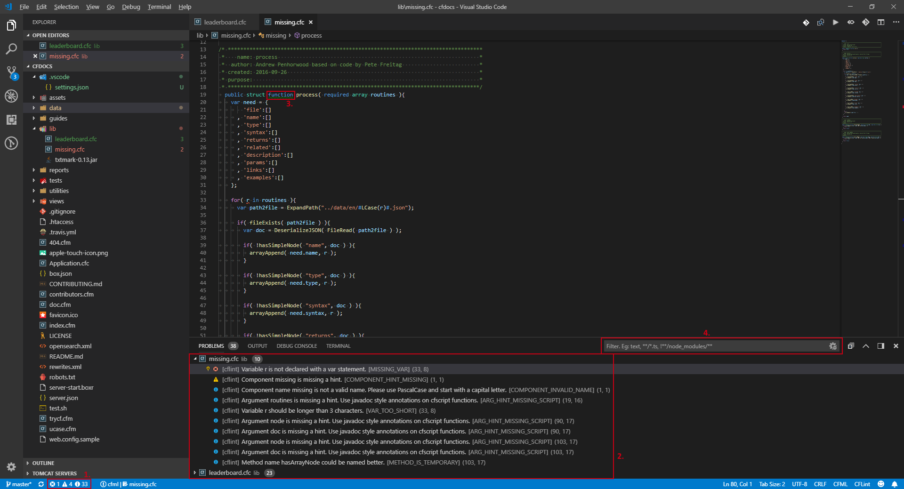

# VS Code CFLint

**CFLint** is a linter for CFML and you can find more information at its [GitHub repository](https://github.com/cflint/CFLint). This extension integrates **CFLint** into VS Code.

## Features

### Linting

This extension uses the **CFLint** tool to scan CFML files and provide feedback on potential issues through the editor and Problems view of VS Code. The ways in which this is triggered are configurable in the [Settings](#settings). The defaults are only to run when CFML files are opened or saved. The linter optionally takes rule configuration via a `.cflintrc` file, for which details can be found at [**CFLint**'s repo](https://github.com/cflint/CFLint#folder-based-configuration). This extension facilitates the creation and viewing of this file via [Commands](#commands). It also facilitates editing the file by utilizing the schema.

Here is an example from the [CFDocs](https://github.com/foundeo/cfdocs) project using **CFLint** v1.4.1 with no rule configuration on VS Code v1.28.

1. The status bar item for Problems. Indicates number of Error, Warning, and Info issues reported, respectively. Clicking it will bring up the Problems view. Alternatively, you can use `Ctrl`+`Shift`+`M`.
2. The Problems view. Grouped by file, ordered by severity, line number, column number. Clicking the problem will focus the issue in the editor.  
`[Quick Fixes] [Severity icon] [Provider] [Issue Message] [Issue ID] (line number, column number)`
3. Highlights within the editor. Hovering reveals the message.
4. Filter issues in Problems view.

### Code Actions / Quick Fixes

These are potential resolutions that are provided for each diagnostic. Aside from the rule changes in the settings file, these are largely dependent on the location given by CFLint. See [Known Issues/Limitations](#known-issueslimitations)

- **Ignoring rules in settings file**: For all rules, this code action is available and when executed will update the `.cflintrc` file that applies to the document within which the diagnostic is triggered.
- **Transforming variable case**: For the `*_INVALID_NAME` and `*_ALLCAPS_NAME` rules, a code action will be offered based on the case preference set.
- **var/local scoping**: For the rule `MISSING_VAR`, two code actions are offered to either add `var` beforehand or `local` as the scope.

### Other

See [Commands](#commands) below.

## Requirements

You must first install **CFLint**. You may skip the steps below if you already have them.

1. Download and install latest **Java SE 8**+ [JRE](https://www.java.com/en/download/manual.jsp), or [JDK](https://adoptopenjdk.net/) if you plan to build it yourself.
1. Download latest **CFLint** (v1.4.0+) standalone/all JAR from [Maven Central](http://search.maven.org/#search%7Cga%7C1%7Ccflint) or [the GitHub releases](https://github.com/cflint/CFLint/releases). Alternatively, build it yourself using [these instructions](https://github.com/cflint/CFLint#building-cflint). This is the JAR file that will be provided to `cflint.jarPath` in the settings.

### Extension dependencies

Requires an extension that contributes the language since linting is only done for particular language IDs. The recommended one is **[KamasamaK.vscode-cfml](https://marketplace.visualstudio.com/items?itemName=KamasamaK.vscode-cfml)**.

## Settings

The following are the configurable Settings (`Ctrl`+`Comma`) that this extension contributes to VS Code:

- `cflint.enabled`: Enable/disable this extension.
- `cflint.javaPath`: [*Optional*] Path to Java executable. Unnecessary if compatible Java path is defined in `JAVA_HOME` or `PATH` environment variables.
- `cflint.jarPath`: A path to the CFLint standalone JAR file (`CFLint-*-all.jar`).
- `cflint.outputDirectory`: A directory in which to place output files when invoking one of the output commands.
- `cflint.exclude`: Glob patterns for excluding files and folders. The pattern is based on the workspace folder being the root.
- `cflint.runModes`: Determines when linter is run.  
**Properties**
  - `cflint.runModes.onOpen`: Run linter whenever a CFML file is opened. [*Default*: `true`]
  - `cflint.runModes.onSave`: Run linter whenever a CFML file is saved. [*Default*: `true`]
  - `cflint.runModes.onChange`: Run linter whenever a CFML file is changed. (Not recommended) [*Default*: `false`]
- `cflint.altConfigFile.path`: [*Optional*] The path to an alternate rule configuration file.
- `cflint.altConfigFile.usage`: Usage of the rule config file from `cflint.altConfigFile.path`.  
**Values**
  - `fallback`: Use only if no rule config is found for document being linted. [*Default*]
  - `always`: Always use.
- `cflint.typingDelay`: The number of milliseconds to wait for typing to stop until linting. Only valid when `cflint.runModes.onChange` is true. [*Default*: `700`]
- `cflint.linterCooldown`: The minimum number of milliseconds to wait between running the linter on a document. [*Default*: `5000`]
- `cflint.maxSimultaneousLints`: The maximum number of simultaneously running lints. Any exceeding this number will be queued. [*Default*: `3`]
- `cflint.ignoreInfo`: Whether to ignore issues with Info severity as problems. [*Default*: `false`]
- `cflint.ignoreWarnings`: Whether to ignore issues with Warning severity as problems. [*Default*: `false`]
- `cflint.notify.latestVersion`: Whether to notify when there is a newer version available. [*Default*: `true`]

## Commands

Used in Command Palette (`Ctrl`+`Shift`+`P`). Alternatively, can be bound to Keyboard Shortcuts (`Ctrl`+`K` `Ctrl`+`S`).

- Enable CFLint for this workspace

- Disable CFLint for this workspace

- Manually run CFLint on currently active file

- Create '.cflintrc' file in the root of the current working directory

- Open '.cflintrc' file in the root of the current working directory

- Create '.cflintrc' file in the current working directory

- Open '.cflintrc' file for currently active document

- Clear CFLint problems for active document

- Clear all CFLint problems

- View CFLint rules documentation (online)

- Output CFLint text file for currently active document

- Output CFLint HTML file for currently active document

- Output CFLint JSON file for currently active document

- Output CFLint XML file for currently active document

_Note_: The output commands above have CFLint produce the reports directly, so some extension settings are not considered.

## Known Issues/Limitations

1. Not an issue with the extension itself, but be aware that **CFLint** is a heavy/slow application compared to most linters, especially when used through the command line. Some things are done with the extension to account for this.
1. As of this writing, **CFLint** (v1.4.1) often misreports issue location.

## Future Plans

- Investigate using [CFLint NPM wrapper](https://www.npmjs.com/package/cflint) as a default with optional manual installation. Currently not using an up-to-date version.
- Investigate useful menu items.
- Investigate where extension performance may be able to be improved (e.g. with Promises, Cancellation Tokens, or Language Server).

## Release Notes

See [CHANGELOG.md](/CHANGELOG.md)

## Contributing

See [CONTRIBUTING.md](/CONTRIBUTING.md)
